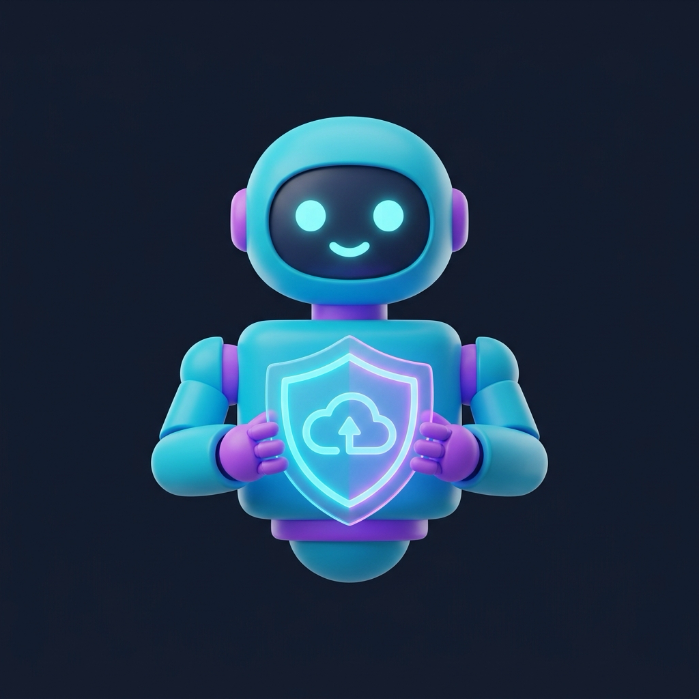
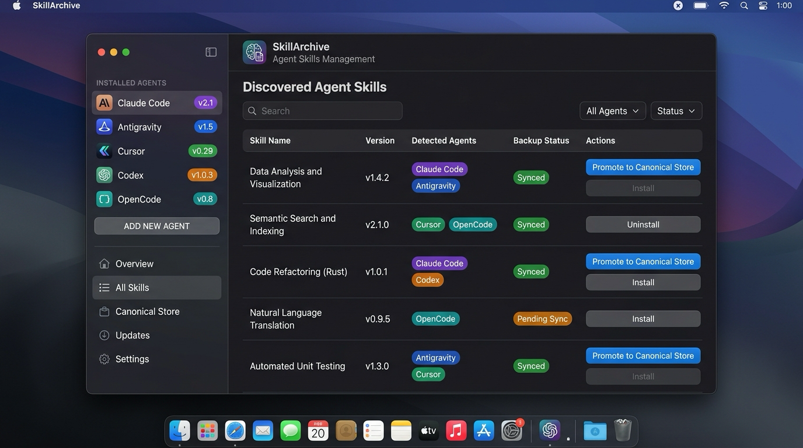

🇰🇷 [한국어](README.md) | 🇺🇸 [English](README.en.md) | 🇯🇵 [日本語](README.ja.md) | 🇨🇳 [中文](README.zh.md)

<p align="center">
  
</p>

<h1 align="center">SkillArchive</h1>

<p align="center">
  Mac에 설치된 다양한 AI 코딩 에이전트(Claude Code, Antigravity, Cursor, Codex 등)의 <b>Agent Skills(SKILL.md)</b>를 자동 탐색하고 백업 및 설치를 지원하는 macOS 네이티브 앱입니다.
</p>

<p align="center">
  
</p>

## 주요 기능

- **크로스 에이전트 자동 스캔**: Claude Code, Cursor, Codex, OpenCode 등 각 에이전트의 전역 폴더 및 로컬 프로젝트에 분산된 스킬 탐색
- **단일 표준 저장소(Canonical Store)**: OS 재설치나 Mac 기기 변경에도 안전하도록 iCloud Drive 기반 통합 저장소 지원
- **스킬 승격 / 백업 / 설치**: 개별 스킬 또는 전체 스킬을 원클릭으로 백업하고 원하는 에이전트에 일괄 설치
- **에이전트별 설치 대상 제어**: 설치할 대상 에이전트 선택 및 현재 Mac에 설치된 에이전트 자동 감지
- **다국어 지원**: 한국어, English, 日本語 지원

## 설치 (Installation)

### Homebrew
```bash
brew tap mrKangHo/tap
brew install skillarchive
```

또는 전용 Cask 직접 설치:
```bash
brew tap mrKangHo/SkillArchive https://github.com/mrKangHo/SkillArchive
brew install --cask skillarchive
```

## 시스템 요구 사양

- macOS 13 (Ventura) 이상
